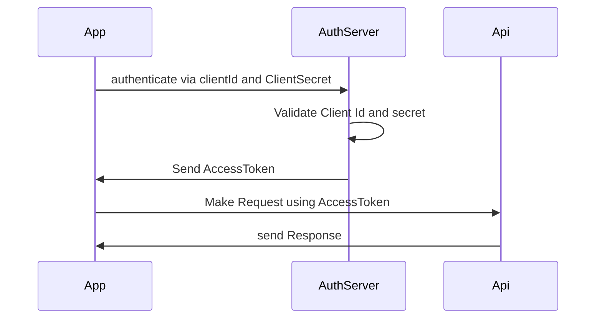
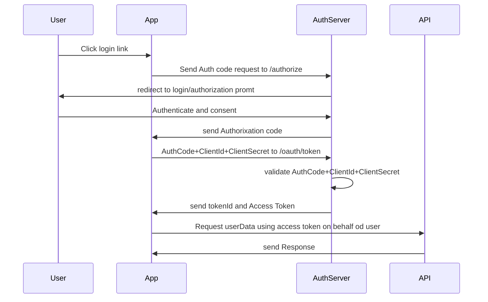

## Client Credentials Workflow


 ##### REST Request 

>POST @ /token endpoint

|param|value|
|------|------|
|headers Auth| base64 encoded (clientid:clientsecret)|
|body|grant_type=client_creds&scope=...|

#####  _Auth Server Response_

```
{
	accessToken:"w/e"
	tokenType:"who cares"
	expiresIn:"tmr"
	scope:"read_Users"
}
````



## Auth Code Workflow
